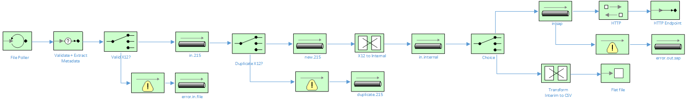

EDI X12 215 Manifest Tranformation in JBoss Fuse and Trace Transformer
=========================================

This project demonstrates content based routing, transformation and duplicate checking of X12 215 Manifest files using JBoss Fuse and Trace Transformer.

The Camel routes used in this example are explained by the following diagram:

Prerequisites
=============

- JBoss Fuse 6.3 (release 187)
- Trace Transformer 3.6.1

    
Install Transformer dependencies in Maven
=========================================

Trace Transformer ships with the OSGi bundles required to interact with JBoss Fuse and Apache Camel.  To install the dependencies, locate the following files from your Transformer installation directory (C:\Program Files\Trace Financial Ltd\Transformer 3.6):

- transformer-runtime-with-log4j-3.6.1-complete.jar
- transformer-camel-3.6.1-osgi-bundle.jar
- transformer-camel-component-1.1.0.jar
- transformer-designtime-3.6.1.jar
- currencylib-1.0.5.jar 

Copy the above files to a temporary location, and execute the following Maven commands:

	mvn install:install-file -DgroupId=com.tracegroup.transformer -DartifactId=transformer-runtime-complete -Dversion=3.6.1 -Dfile=transformer-runtime-with-log4j-3.6.1-complete.jar -Dpackaging=jar
	mvn install:install-file -DgroupId=com.tracegroup.transformer -DartifactId=transformer-camel-osgi -Dversion=3.6.1 -Dfile=transformer-camel-3.6.1-osgi-bundle.jar -Dpackaging=jar
	mvn install:install-file -DgroupId=com.tracegroup.transformer -DartifactId=transformer-camel-component -Dversion=1.1.0 -Dfile=transformer-camel-component-1.1.0.jar -Dpackaging=jar
	mvn install:install-file -DgroupId=com.tracegroup.transformer -DartifactId=transformer-designtime -Dversion=3.6.1 -Dfile=transformer-designtime-3.6.1.jar -Dpackaging=jar
	mvn install:install-file -DgroupId=com.tracegroup.transformer -DartifactId=currencylib -Dversion=1.0.5 -Dfile=currencylib-1.0.5.jar -Dpackaging=jar

Install Transformer dependencies and Camel project to Karaf:
=================================================================================

Before we can build the Camel project, we need to install the txfmrm Camel component to Maven.  To do this, copy the following directory to a temp directory: C:\Program Files\Trace Financial Ltd\Transformer 3.6\maven\TransformerTestCamelComponent

Build the TransformerTestCamelComponent:

	mvn clean install

Once all the Trace dependencies are installed to Maven and the TransformerTestCamelComponent is built, install the edi-shipment-to-sap Camel project:

	mvn clean install
	
Start-up Karaf, and via the Karaf console, execute the following commands to install the Transformer dependencies:

	install -s mvn:com.tracegroup.transformer/currencylib/1.0.5
	install -s mvn:com.tracegroup.transformer/transformer-camel-component/1.1.0
	install -s mvn:com.tracegroup.transformer/transformer-camel-osgi/3.6.1
	
Now we can install our Transformer mappings for the X12 215 format:

	install -s mvn:com.redhat.edi/InnovapostPoC/1.0.0
	
And finally, we can install our Camel OSGi bundle with our Camel routes:

	install -s mvn:com.redhat/edi-shipment-to-sap/1.0.0